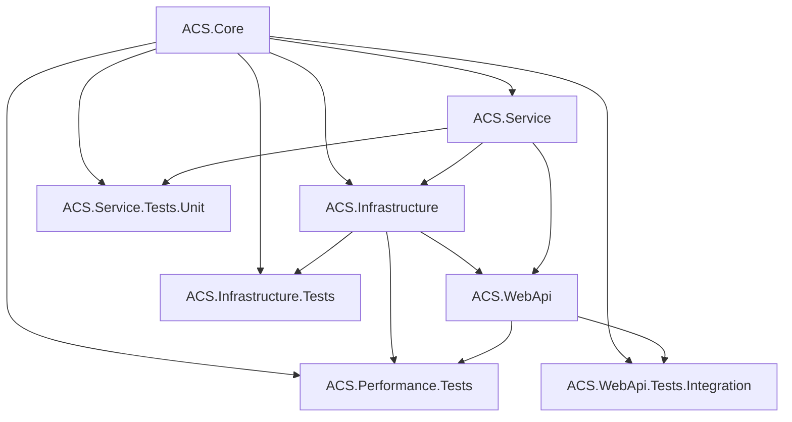

# ACS LMAX Implementation - Assembly Plan

## Current Assembly Inventory

### ✅ **KEEP & ENHANCE - Core Value Assemblies**

#### **ACS.Service** - Domain & Business Logic
- **Status**: ✅ KEEP - Contains valuable domain models and normalizers
- **Content**: 
  - Complete domain models (Entity, User, Group, Role, Permission, HttpVerb, Scheme)
  - 13 proven normalizers with comprehensive functionality
  - Data models and ApplicationDbContext
  - Existing services (UserService, IUserService)
- **LMAX Role**: Core domain logic and operational normalization pattern
- **Enhancements Needed**: 
  - Add LMAX infrastructure components
  - Add domain service facade
  - Add in-memory entity graph

#### **ACS.WebApi** - API Layer
- **Status**: ✅ KEEP - Application host and entry point
- **Content**: 
  - Program.cs with basic setup
  - Empty Controllers folder
- **LMAX Role**: High-performance API endpoints and tenant resolution
- **Enhancements Needed**:
  - Add all controllers (Users, Groups, Roles)
  - Add middleware (tenant resolution, error handling)
  - Add LMAX-specific configuration

#### **ACS.Database** - Data Schema
- **Status**: ✅ KEEP - Complete database schema
- **Content**: 
  - All 10 tables with proper relationships
  - Seed data and constraints
- **LMAX Role**: Database schema for multi-tenant data storage
- **Enhancements Needed**: 
  - Add tenant-specific connection string patterns
  - Add deployment scripts for multi-tenant scenarios

#### **ACS.Service.Tests.Unit** - Core Testing
- **Status**: ✅ KEEP - Contains 40+ valuable tests
- **Content**: 
  - Comprehensive normalizer tests
  - Domain integration tests
  - Established test patterns
- **LMAX Role**: Regression testing for existing functionality
- **Enhancements Needed**:
  - Add LMAX infrastructure tests
  - Add multi-tenant testing scenarios

#### **ACS.WebApi.Tests.Integration** - API Testing
- **Status**: ✅ KEEP - API testing framework
- **Content**: 
  - Basic integration test setup
  - Placeholder tests
- **LMAX Role**: End-to-end API testing
- **Enhancements Needed**:
  - Add comprehensive controller tests
  - Add multi-tenant API testing

### ❌ **REMOVE - Empty/Obsolete Assemblies**

#### **ACS.WebResources** - Empty Assembly
- **Status**: ❌ REMOVE - Contains only empty Class1.cs
- **Reason**: No valuable content, unclear purpose in LMAX architecture
- **Action**: Delete assembly and all references

#### **ACS.WebResources.Tests.Unit** - Empty Test Assembly
- **Status**: ❌ REMOVE - Tests for empty assembly
- **Reason**: No purpose if parent assembly is removed
- **Action**: Delete assembly and all references

#### **ACS.WebResources.Tests.Integration** - Empty Test Assembly
- **Status**: ❌ REMOVE - Tests for empty assembly
- **Reason**: No purpose if parent assembly is removed
- **Action**: Delete assembly and all references

#### **ACS.Service.Tests** - Redundant Test Assembly
- **Status**: ❌ REMOVE - Overlaps with ACS.Service.Tests.Unit
- **Content**: Some domain tests that should be moved to Unit project
- **Reason**: Redundant with better-organized Unit test project
- **Action**: Migrate valuable tests to ACS.Service.Tests.Unit, then delete

#### **ACS.WebApi.Tests.Unit** - Minimal Value
- **Status**: ❌ REMOVE - Placeholder unit tests only
- **Reason**: API controllers are better tested through integration tests
- **Action**: Delete assembly, focus on integration testing

### 🆕 **ADD - New LMAX-Specific Assemblies**

#### **ACS.Core** - Shared Abstractions
- **Purpose**: Shared contracts and abstractions across assemblies
- **Content**:
  - ITenantServiceProvider interface
  - ITenantConfigurationProvider interface
  - Common tenant models and DTOs
  - Shared enums and constants
  - Base exception types
- **Dependencies**: None (pure abstractions)
- **Phase**: Phase 1

#### **ACS.Infrastructure** - LMAX Infrastructure
- **Purpose**: LMAX-specific infrastructure components
- **Content**:
  - TenantServiceProvider implementation
  - TenantRingBuffer implementation
  - TenantAccessControlHostedService
  - InMemoryEntityGraph
  - Multi-tenant configuration providers
- **Dependencies**: ACS.Core, ACS.Service
- **Phase**: Phase 1

#### **ACS.Infrastructure.Tests** - Infrastructure Testing
- **Purpose**: Comprehensive testing of LMAX infrastructure
- **Content**:
  - TenantServiceProvider tests
  - Ring buffer performance tests
  - Multi-tenant isolation tests
  - In-memory entity graph tests
  - Hosted service lifecycle tests
- **Dependencies**: ACS.Infrastructure, ACS.Core
- **Phase**: Phase 1

#### **ACS.Performance.Tests** - Load & Performance Testing
- **Purpose**: LMAX performance validation and benchmarking
- **Content**:
  - Ring buffer throughput tests
  - Memory usage profiling
  - Multi-tenant scaling tests
  - API performance benchmarks
  - Entity graph loading performance
- **Dependencies**: ACS.Infrastructure, ACS.WebApi
- **Phase**: Phase 4

## Final Assembly Structure

### **Production Assemblies**
```
ACS.Core                    - Shared abstractions
├── ACS.Service            - Domain models, normalizers, data access
├── ACS.Infrastructure     - LMAX infrastructure components
└── ACS.WebApi            - API controllers, middleware, hosting
    └── ACS.Database      - SQL schema and deployment
```

### **Test Assemblies**
```
ACS.Service.Tests.Unit        - Domain and normalizer unit tests
ACS.Infrastructure.Tests      - LMAX infrastructure tests
ACS.WebApi.Tests.Integration  - End-to-end API integration tests
ACS.Performance.Tests         - Performance and load testing
```

## Assembly Dependencies



## Implementation Action Plan

### **Phase 1: Assembly Cleanup**
1. **Create ACS.Core assembly** with shared abstractions
2. **Create ACS.Infrastructure assembly** with LMAX components
3. **Delete obsolete assemblies**:
   - Remove ACS.WebResources and all references
   - Remove ACS.WebResources.Tests.* and all references
   - Migrate ACS.Service.Tests content to ACS.Service.Tests.Unit
   - Remove ACS.Service.Tests
   - Remove ACS.WebApi.Tests.Unit
4. **Update solution file** with new structure

### **Phase 2: Infrastructure Implementation**
1. **Implement ACS.Core contracts**
2. **Implement ACS.Infrastructure components**
3. **Update ACS.Service** with LMAX integration points
4. **Update ACS.WebApi** with new dependencies

### **Phase 3: Testing Framework**
1. **Create ACS.Infrastructure.Tests**
2. **Enhance ACS.Service.Tests.Unit** with LMAX scenarios
3. **Enhance ACS.WebApi.Tests.Integration** with multi-tenant tests
4. **Create ACS.Performance.Tests** for benchmarking

### **Phase 4: Validation**
1. **Verify all dependencies resolve correctly**
2. **Ensure clean separation of concerns**
3. **Validate multi-tenant isolation**
4. **Performance baseline establishment**

## Assembly Specifications

### **ACS.Core Specification**
- **Target Framework**: .NET 8.0
- **Package Type**: Library
- **Dependencies**: Microsoft.Extensions.DependencyInjection.Abstractions
- **Key Interfaces**:
  ```csharp
  public interface ITenantServiceProvider
  public interface ITenantConfigurationProvider  
  public interface ITenantRingBuffer
  public interface IInMemoryEntityGraph
  ```

### **ACS.Infrastructure Specification**
- **Target Framework**: .NET 8.0
- **Package Type**: Library
- **Dependencies**: 
  - ACS.Core
  - ACS.Service
  - Microsoft.Extensions.Hosting
  - System.Threading.Channels
- **Key Classes**:
  ```csharp
  public class TenantServiceProvider : ITenantServiceProvider
  public class TenantRingBuffer : ITenantRingBuffer
  public class TenantAccessControlHostedService : BackgroundService
  public class InMemoryEntityGraph : IInMemoryEntityGraph
  ```

## Assembly Size Estimates

| Assembly | Estimated Classes | Estimated LOC | Complexity |
|----------|------------------|---------------|------------|
| ACS.Core | 8-12 | 500-800 | Low |
| ACS.Infrastructure | 15-20 | 2000-3000 | High |
| ACS.Service (Enhanced) | 25-30 | 3000-4000 | Medium |
| ACS.WebApi (Enhanced) | 12-15 | 1500-2000 | Medium |

## Benefits of This Assembly Structure

### **Separation of Concerns**
- **ACS.Core**: Pure abstractions, no implementation details
- **ACS.Infrastructure**: LMAX-specific implementations
- **ACS.Service**: Domain logic remains clean
- **ACS.WebApi**: API layer focuses on HTTP concerns

### **Testability**
- Each assembly can be unit tested independently
- Infrastructure can be mocked via ACS.Core interfaces
- Performance testing isolated in dedicated assembly

### **Deployment Flexibility**
- Core and Service can be shared across different hosting models
- Infrastructure can be swapped for different performance patterns
- WebApi can be deployed independently for scaling

### **Maintainability**
- Clear boundaries between LMAX infrastructure and domain logic
- Easy to understand dependencies and data flow
- Future enhancements isolated to appropriate assemblies

This assembly plan provides a clean, scalable foundation for the LMAX implementation while preserving all valuable existing code and eliminating obsolete components.